# Multi-head Latent Attention — Hand-Written CUDA Kernels

Hand-written CUDA implementation of DeepSeek-V3's **Multi-head Latent Attention
(MLA)**, benchmarked end to end against a
PyTorch/cuBLAS reference on an RTX A6000.

```
hidden = 7168     H (heads)  = 128     kv_lora_rank  = 512     q_lora_rank = 1536
nope   = 128      rope       = 64      qk_head_dim   = 192     v_head_dim  = 128
Q_absorbed  = 512 + 64 = 576
```

**Results:** CUDA kernel runs at a **geometric-mean 0.83× of the PyTorch/cuBLAS
baseline**. See [Benchmarks](#3-benchmarks).

## Contents

1. [Why MLA?](#1-why-mla)
2. [Algorithm](#2-algorithm)
3. [Benchmarks](#3-benchmarks)
4. [Profiling Different Stages](#4-profiling-different-stages-with-nsight-compute)
5. [Build and Run](#5-build-and-run)

---

# 1. Why MLA?

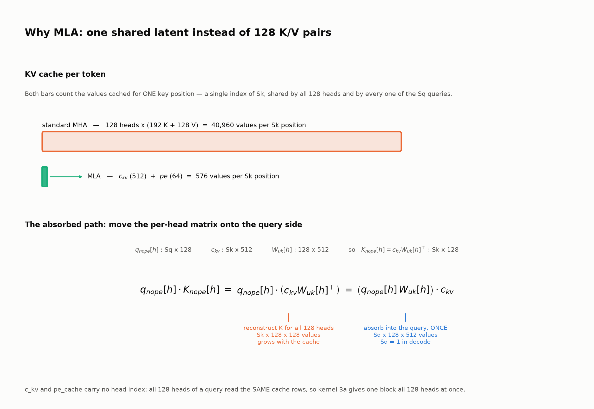

Two consequences shape every kernel here:

- **The KV cache is reused across all heads.** The cache is the pair
  `c_kv [B, Sk, 512]` and `pe_cache [B, Sk, 64]`; a *cache row* is one key's
  `c_kv[b, k, :]` (512 latent *ranks*) plus `pe_cache[b, k, :]` (64 rope dims).
  A **rank** is one index along `kv_lora_rank = 512`: the cache never stores K or
  V. Neither tensor has an `H` axis, so all 128 heads of a query score against the
  identical `k` rows — unlike standard MHA. Step 3a exploits this directly: its 
  128-row thread block tile is exactly `H`, so a block's rows are the 128 heads 
  of one query, and each `[128 keys × 32 dims]` slab it stages into shared memory 
  — one step of the 576-deep reduction, taken from `c_kv`'s 512 ranks and then 
  `pe_cache`'s 64 rope dims — is read by all 128 of them.
- **The projection weights are reused across a batch.** `W_uk [H, 128 nope, 512]` and
  `W_uv [H, 128 v_dim, 512]` carry a head axis, which is the same panel for every 
  query in a batch. The reuse is therefore over **`bq` rows**: the `B·Sq` 
  (batch, query-position) pairs. Step 2c gives one head to each thread block
  (`grid.z = h`); a block stages only its own head's slice of `W_uk`, but stages it 
  once for its whole tile of `bq` rows (16–128 rows). So, a block per `(bq, h)` would 
  re-read head `h`'s panel once per row instead. 3d does the same with `W_uv[h]`.
- **Decode is memory-bound.** With `Sq = 1` there is no arithmetic intensity in the attention calculation; the wins come from not moving bytes and from keeping all 84 SMs busy.

---

# 2. Algorithm

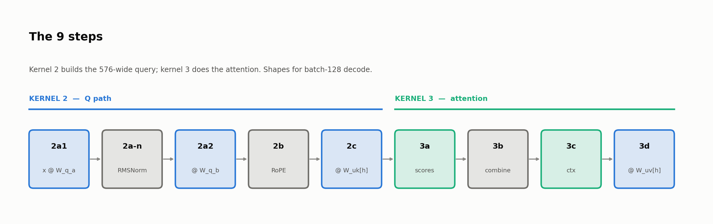

Shapes throughout are for **batch-128 decode**: `B=128, Sq=1, H=128`, so
`bq = B·Sq = 128` rows and `flat = B·Sq·H = 16,384` rows, at DeepSeek's reported
production-average cache depth `Sk = 4,989`.

### High-Throughput GEMM Recipe

Five kernels across six of the nine steps (2a1, 2a2, 2c, 3a, 3c, 3d) are the same GEMM shape and
use one recipe, so the per-step notes below only list what is *specific* to that
step:

- **Coalescing** - All operand traffic is contiguous and line-aligned. Three
  things enable this: `threadIdx.x` indexes the contiguous axis on the staging loads 
  as well as the stores; each thread's 8 outputs are strided by `blockDim.x`, so one store instruction has the warp's lanes writing *adjacent* floats; and row strides are kept a 
  multiple of 32 floats, so every row starts on a 128 B line (padded for `scores`,
  whose width is `Sk` and not always line-aligned). 
- **Bank-conflict-*reduced* shared memory** - Row padding by `+1` rather than an XOR
  swizzle. Padding keeps the address *linear* in the reduction
  index, so addressing is a base pointer plus immediate offsets instead of an XOR
  and an add per operand per step. This reduces the ALU pressure,
  and it frees registers — a swizzle keeps its mask and permuted index live across
  the *entire* reduction, every such value is one the scheduler cannot spend on 
  prefetching the next operand. Measured at **4,473× fewer** shared-load bank
  conflicts than an unpadded stride and 3.45× off the kernel, though not to zero —
  663,937 remain. See [4.6](#46-shared-memory-bank-conflicts--pad-the-row-stride).
- **64x ILP per thread** - `16×16 = 256` threads per block, **8×8 
  outputs per thread**, resulting in `128×128 output tile per thread block`. An M×N register tile costs M+N shared-memory loads per M·N FMAs, 
  so 8×8 gives 0.25 loads/FMA — sm_86 issues 128 FP32 lanes per SM against 32 shared-memory
  words (4 Bytes) per clock, i.e. it wants exactly 4 FMAs per loaded word.
- **Occupancy traded for ILP** - The 8×8 tile requiress 64 accumulator registers, with 
  operands, addressing, bounds and loop state accounting consuming to **107 to 128**
  registers per thread. `__launch_bounds__(256, 2)` caps a thread at
  `65,536 / 512 = 128 registers`, so all kernels fit without spilling. Asking for 3
  resident blocks instead caps them at 85 and spills 138 M local ld/st — for *no*
  occupancy gain, since shared memory already limits residency to 2. See
  [4.4](#44-register-spilling--do-not-over-request-residency).
- **Split-K when the output cannot fill the GPU** - A 128×128 output tile
  means a small output yields few blocks: 2a1's 1536 columns are 12 tiles, and the
  `bq` dimension collapses to a single tile for any `bq_total ≤ 128` — most of
  decode — so the launch would occupy 12 of 84 SMs. Split-K adds a grid dimension
  over the *reduction* instead: each slice takes a disjoint span of it, accumulates
  its own partial, and `atomicAdd`s into a pre-zeroed output. Worth **7.6×** on
  2a1 at `bq = 1`, where it takes the grid from 12 blocks to 1,344. See
  [4.1](#41-wave-quantization--split-the-reduction).
- **Tiling of contracted dimension** - A block's 128×128 output
  tile is a dot product over 32-deep chunks: all 256 threads cooperatively stage a 
  `[128 × 32]` slab of each operand into shared memory, barrier, reduce that slab into 
  the register tiles, barrier, repeat. 32 is the largest chunk that keeps **2 blocks resident per SM**
  — `(128 + 128) × 33 × 4 B = 33.8 KB` per block, so 67.6 KB of the SM's 100 KB,
  and 32 floats is exactly a 128 B cache line, so each staged row is one aligned transaction.
- **Staging loops strength-reduced to one multiply per element** - Every staging
  loop walks `idx += 256` and splits it with `idx / D` and `idx % D`, for `D` of
  32 (reduction-tile loops) or 128 (column-tile loops). 256 is a multiple of
  both, so `idx % D` never changes across passes: that index and the
  `< tile_len` predicate built on it are loop-invariant and hoist out of the loop
  entirely, the *other* index then advances by a constant so its bound becomes a
  trip count rather than a per-element compare, and every block-invariant offset
  folds into a base pointer once. What is left in the body is one row multiply,
  one load and one store — against a shift, a mask, two compares, a source select
  and a runtime-stride `IMAD` before. Worth **0.77× → 0.83×** end to end. Note
  what it is *not*: register pressure barely moved, and unrolling the reduction
  strip (which does cut registers, 127 → 110 on 3a) buys nothing. The strip is
  already at the shared-memory bandwidth ceiling, so rescheduling the same work
  cannot help — only issuing less of it.
- **Bounds check during results write-out** - A block always computes its whole 
  128×128 tile, even when the real matrix has fewer rows or columns than that. 
  The threads holding the leftover slots read whatever happens to be in shared 
  memory, do their multiply-adds anyway, and the write-out step at the end simply 
  skips them. The price is that a tile bigger than the data does real work for 
  nothing, which is what the adaptive `bq` tile below avoids.
- **Adaptive `bq` tile** - Kernels with row axis `bq` pick their tile height at
  launch. The thread block is always 16×16 threads and `threadIdx.y` walks rows, so 
  if each of those 16 columns owns `kBqReg` rows the tile is `16 × kBqReg` = 16, 32, 
  64 or 128 rows, and a thread's accumulator block is `kBqReg × 8`. A single-stream decode has exactly one real row, so a 128-row tile would do 128 rows of work to keep 1. `bq_reg_for()` therefore picks the **smallest tile that still covers `bq_total`**: 16 at `bq = 1` (the floor, since `blockDim.y = 16`), 32 at `bq = 20`, etc., freeing up registers to increase occupancy. Pinning the tile at 128 costs 8× the FFMA
  instructions and 125 registers a thread against 79. See
  [4.2](#42-work-thrown-away--size-the-tile-to-the-problem).

---

## Step 2a1 — Project the Hidden State into the Latent

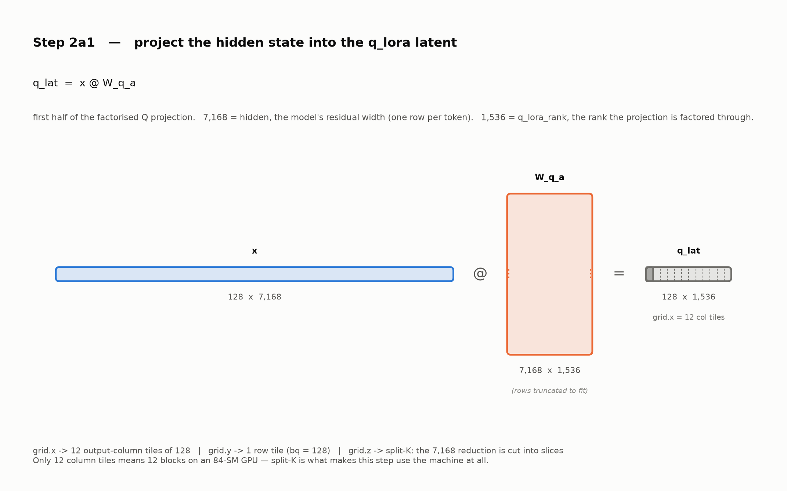

**Techniques Specific to This Step**

- **Low-rank factorization (algorithmic).** This step exists only because the Q
  projection is factored through `q_lora_rank = 1536` rather than applied as one
  dense `[7168, 24576]` matrix in the next step.
- **Split-K over the 7,168 reduction.** The output is only 1536 columns = 12
  block tiles, so without Split-K this step runs 12 blocks on an 84-SM GPU.

## Step 2a-norm — RMSNorm on the Latent

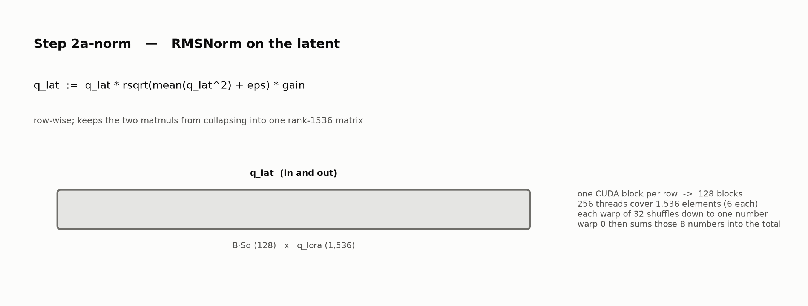

**Techniques Specific to This Step**

- **Normalization to break matrices (algorithmic).** Matmul is associative, so with
  nothing between them `(x @ W_q_a) @ W_q_b` equals `x @ (W_q_a @ W_q_b)` — one
  precomputable `[7168, 24576]` matrix. What you would lose is *meaning*: the pair 
  would carry no more expressive power than a single rank-1536 linear layer, and the
  latent between them would have no fixed identity, since for any invertible
  `G [1536, 1536]` the pair `(W_q_a G, G⁻¹ W_q_b)` computes the identical function.
  RMSNorm removes that freedom: its scale is `rsqrt(mean(q_lat²))`, taken from the
  row's own values, so it acts in one specific basis and cannot be absorbed into
  either weight. The learnable `gain` *is* linear and could be folded into `W_q_b`;
  only the data-dependent factor does this work. 
- **Single-kernel block reduction.** One block owns a whole row — 1,536 values
  across 256 threads, 6 each — so the RMS never leaves the block. Each thread sums
  its own squares, `__shfl_down` collapses each warp of 32 down to one number
  (8 warps, so 8 partial sums), those 8 go through shared memory, and warp 0 runs
  one more shuffle round over them to finish the total. Two barriers in all, no
  shared-memory reduction tree, no second kernel launch, and the mean never
  round-trips through global memory.

## Step 2a2 — Expand the Latent into the Per-Head Query

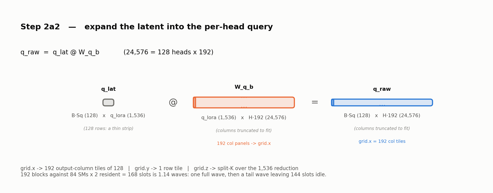

**Techniques Specific to This Step**

- **Split-K sized against wave quantization.** 24576/128 = 192 blocks against
  84 SMs × 2 resident = 168 slots is **1.14 waves**: one full wave, then a tail
  wave leaving 144 slots idle — 43% of the machine. The planner targets ~8 waves,
  where the tail costs ~11%.
- **Blocking over `bq`.** A block owns 128 output columns
  for *all* 128 `bq` rows, so the grid is 192 column tiles by one row tile. These
  192 blocks all read the same `q_lat`, which stays in L2, and take disjoint column
  panels of `W_q_b`, so the weight is fetched only once across the grid.

## Step 2b — RoPE

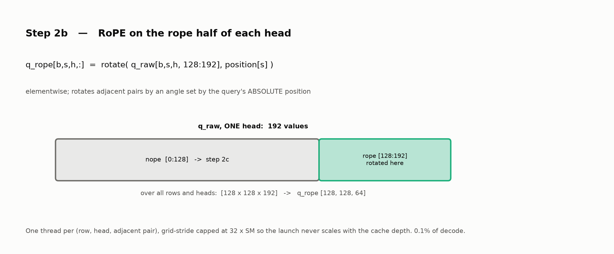

**Techniques Specific to This Step**

- **Slice happens in the addressing, not in the tensor.** The rope half is
  columns `128:192` of each head's 192, so a thread reads `q_raw` directly at that
  offset with stride 192 — nothing is sliced or copied first — and writes its
  rotated pair into a *dense* `q_rope [B, Sq, H, 64]`.
- **One thread per (row, head, adjacent pair), grid capped at `32 × SM`  blocks.**
  The work is `bq × H × 32` pairs — `32 × SM` = 2,688 blocks is about five waves 
  of residency — a 256-thread block caps at 6 per SM — enough that a straggler 
  cannot idle the machine, while keeping block-dispatch cost amortized. 
- **The lane index *is* the pair index, which is what coalesces both sides.** A
  warp's 32 lanes share one `(bq, h)` and take that head's 32 pairs, so their
  addresses form one 256 B window — and it is 256 B-*aligned* on the load
  and on the store. No shared memory is involved at any point here,
  so the bank-conflict rules from the GEMM recipe do not apply to this step. 

## Step 2c — Absorb `W_uk` into the Query

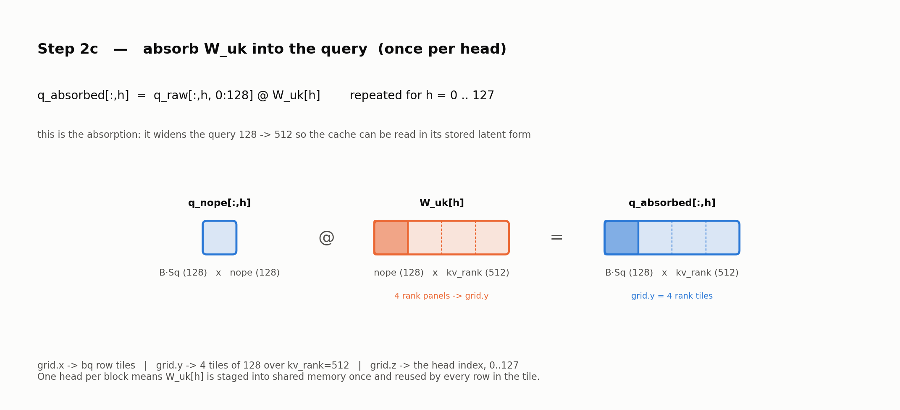

**Techniques Specific to This Step**

- **One head per thread block** (`grid.z = h`). The step is `q_nope[:, h] @ W_uk[h]`. 
  Each head's 128 non-rope query dims, columns `0:128` of its 192 in `q_raw`. 
  `grid.y` cuts the 512 output ranks into 4 tiles of 128, so a block needs only the 
  matching columns of the weight: `W_uk[h][:, r₀:r₀+128]`. It stages that once and 
  reuses it for every `bq` row it owns — the `B·Sq` (batch, query-position) pairs.
- **In-place slicing.** The nope half is read straight out of `q_raw` at stride
  192; no separate slice tensor is materialized.

## Step 3a — Scores and Local Softmax Numerator

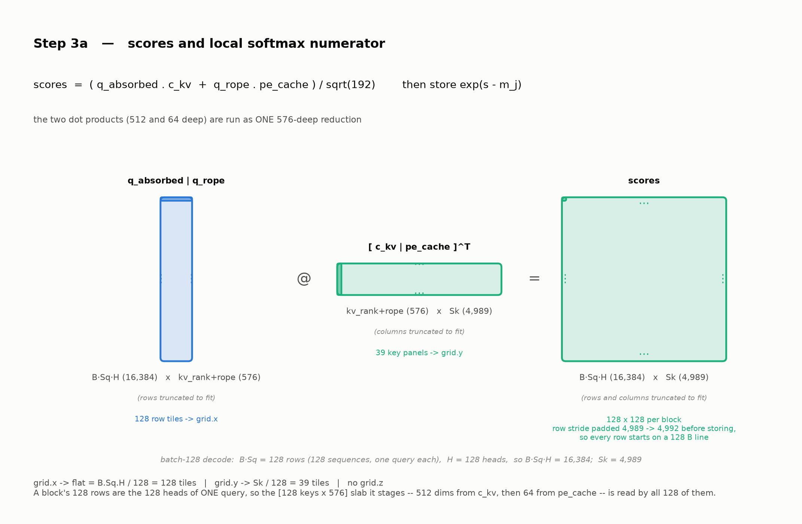

**Techniques Specific to This Step**

- **One merged 576-deep reduction.** `q_absorbed·c_kv` (512) and
  `q_rope·pe_cache` (64) run as a single loop that switches source operand at the
  boundary — no mid-kernel re-stage of aliased shared memory, no extra barrier
  pair, one row width throughout.
- **Cache reuse across all 128 heads.** The block tile is 128 rows = exactly `H`,
  so a block's rows are the 128 heads of one query. The slab it stages is
  `[128 keys × 32 dims]` per reduction step, `[128 keys × 576]` over the whole
  block — 512 of those dims from `c_kv` and the last 64 from `pe_cache` — and every
  one of the 128 heads requires it.
- **Softmax exponentials.** Each score is already sitting in a register here, so
  3a exponentiates it on the way out and accumulates a partial sum. `grid.y` gives a
  block only 128 of the `Sk` keys: 8 keys in a thread's own registers, then the 16
  threads sharing that row combined by an `__shfl_xor` butterfly. That needs no
  shared memory and no barrier because those 16 threads are half of one warp. The
  tile is sized for it — `16 threads × 8 keys = 128 = kScoreSkTile`, so a row's
  whole slice is warp-local. What block `j` ends up with is the pair `(m_j, l_j)`:
  the largest score it saw, and `l_j = Σ exp(s − m_j)` over its 128 keys. The 39
  such pairs per row are reconciled into the real denominator by 3b.
- **Output row-stride padded to 128 B lines.** `scores` is `Sk` wide and `Sk` is a
  runtime value: at 4,989 a row is 19,956 B, not a whole number of cache lines, so
  each row begins at a different offset inside one and a warp's 64 B store run
  straddles a sector boundary instead of filling two. Rounding the stride up to
  4,992 floats — the next multiple of 32 — starts every row on a line. The 3 pad 
  columns are never written or read. The metric that shows the cost is **main-memory
  traffic**, and it is 3c — which reads `scores` back — that pays it: unpadded, 3c's
  DRAM traffic rises 2.69 → 3.00 GB, **+329 MB per decode step**. See
  [4.7](#47-the-scores-row-stride--profile-the-consumer-not-the-producer).
- **Switching operands mid-reduction is free.** Running one 576-deep loop means
  the staging code has to pick its source at `r = 512` — `c_kv` before it,
  `pe_cache` after — which could have meant a test per staged element. There is a
  flag `rope = r0 >= kv_rank`, where `r0` is the reduction-tile counter walking
  `0, 32, 64 … 544` through the 576 depth. Being a loop counter, it is identical
  for every thread and constant for the whole tile — no branch per element and
  no divergence. That same 32 is what both staging loops, q side and c_kv cache 
  side, divide their index by, so the column index and its `< tile_len` predicate 
  are computed once and serve both.

## Step 3b — Calculate the Per-Block Softmax Maxima

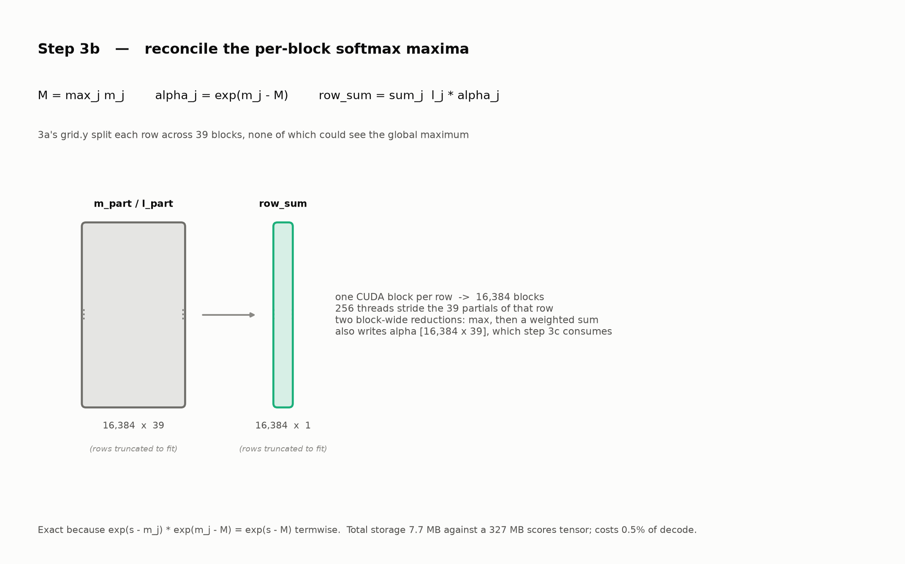

**Techniques Specific to This Step**

- **The flash-softmax combine as a separate pass.** Softmax needs `exp(s − M)`
  with `M` the maximum over all `Sk` keys of the row, but each 3a block saw only
  its own 128 of them, so block `j` exponentiated against its *local* maximum `m_j`
  and stored `exp(s − m_j)`. 3b reads the 39 maxima of a row, takes the largest of
  them, `M = max(m_0 … m_38)`, and writes the correction `alpha_j = exp(m_j − M)`. 
  One multiply then repairs any stored score, `exp(s − m_j) · exp(m_j − M) = exp(s − M)`. 
  The same `alpha_j` reweights the partial sums into the real denominator: 
  `row_sum = Σ l_j · alpha_j` over the 39 partials.
- **The kernel boundary is the grid-wide barrier.** `M` is not knowable until all
  39 of a row's blocks have reported, and blocks within one launch cannot wait for
  each other — so ending 3a and starting 3b *is* that barrier. Atomics would not
  substitute: `(M, row_sum)` is a **coupled** update, since raising `M` invalidates
  every term already accumulated into `row_sum` — they all need rescaling by
  `exp(M_old − M_new)` — so the pair has to move as one indivisible step, which
  takes a lock rather than an atomic. 
- **`alpha` does double duty.** Weight in this kernel's denominator sum
  *and* exactly the factor step 3c needs, so one array serves both.

## Step 3c — Context

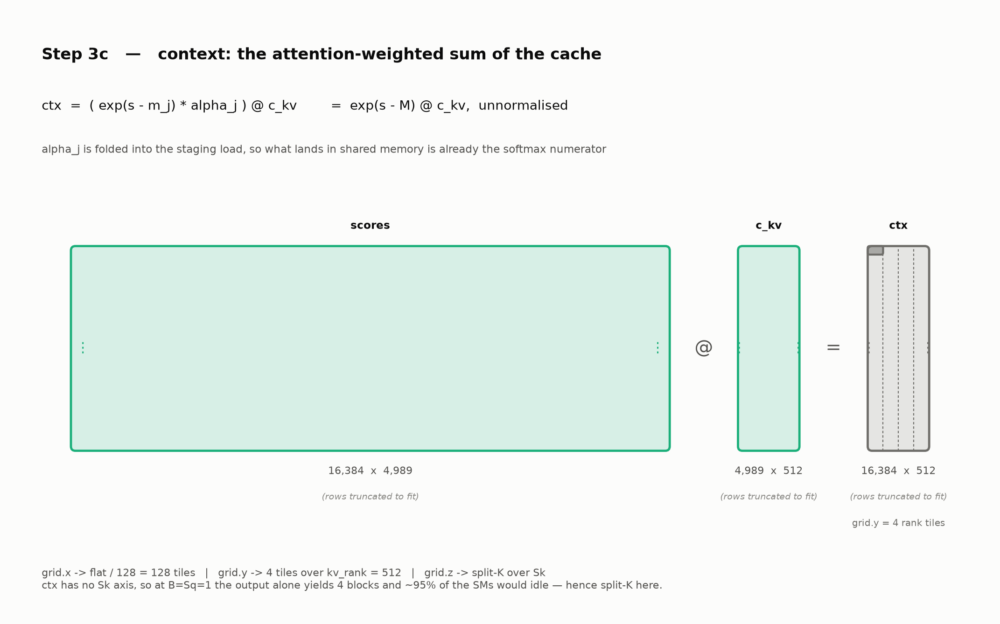

**Techniques Specific to This Step**

- **Correction is applied while the scores are being copied in.** 3c has to
  bring `scores` from global into shared memory regardless, so the `alpha_j`
  multiply is done in transit — what lands in shared memory is already
  `exp(s − M)`, the softmax numerator, ready to reduce. The Sk loop is *read data → barrier → reduce → barrier* with
  no softmax operation, like exponential, max scan, or row-sum pass in between.
- **Split-K over Sk.** `ctx` has no `Sk` axis, so at `B=Sq=1` the output alone
  yields 4 blocks and ~95% of the SMs would idle. Every slice stages values
  already on the global scale `M`, so the partials are addable *by construction*.
- **`alpha` read straight from global** Only 128 distinct values are live per tile
  in a block and the threads sharing a row hit the same address, so it stays
  L1-resident and costs no barrier.

## Step 3d — Reconstruct V and Project Out

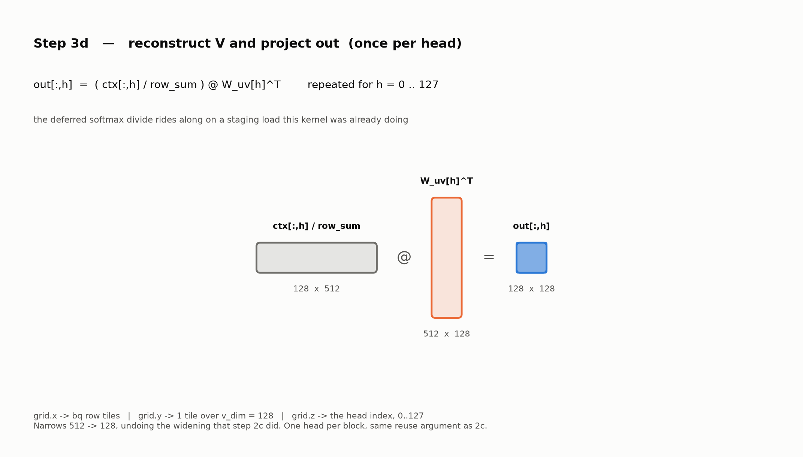

**Techniques Specific to This Step**

- **One head per block** (`grid.z = h`). The step is `ctx[:, h] @ W_uv[h]^T`, or
  `[bq, 512] @ [512, 128] → [bq, 128]`. It contracts over `kv_rank` and narrows the
  head back to `v_dim = 128`. `v_dim` is exactly one 128-wide tile, so `grid.y` 
  does not split anything. `W_uv` panel is staged 32 ranks at a time and reused 
  across every `bq` row the block owns.
- **Deferred softmax divide.** The division by `row_sum` waits until here, where it
  is nearly free: 3d copies `ctx` into shared memory anyway, so the multiply happens
  in transit, against one reciprocal per row worked out up front. Dividing earlier,
  in 3c, would break split-K — its slices only add while they share one
  unnormalized scale.

---

# 3. Benchmarks

## Baseline

[`baseline_official_mla_attention`](exhaustive_benchmark_suite.py#L387) runs the
**same nine steps** in idiomatic PyTorch on cuBLAS, transcribed from DeepSeek-V3's
official `inference/model.py` absorbed path. Step for step:

| step | what the baseline calls |
|---|---|
| 2a1, 2a-norm, 2a2 | `x @ W_q.a` → `rmsnorm` → `@ W_q.b` |
| 2b | `apply_rope` on the `[..., 128:192]` slice |
| 2c | `einsum("bsni,nir->bsnr")` — a batched GEMM, one per head |
| 3a | `einsum("bqhr,bsr->bqhs")` + `einsum("bqhd,bsd->bqhs")`, summed and scaled |
| 3b | no counterpart — `torch.softmax(dim=-1)` does the max, exp and divide in one |
| 3c | `einsum("bqhs,bsr->bqhr")` |
| 3d | `einsum("bqhr,hdr->bqhd")` |

Every intermediate is materialized on both sides, including the `[B, Sq, H, Sk]`
score matrix, so neither implementation is getting a fusion the other cannot.

What makes it a fair comparison:

- **Identical mathematics and shapes.** Both sides consume the same factorized
  `W_q_a / q_norm_w / W_q_b`, the same `wkv_b`, the same absolute positions.
- **TF32 disabled on both sides.** The baseline runs true FP32 cuBLAS; leaving
  TF32 on would have handed it tensor cores while the kernels stayed on CUDA
  cores.
- **Both timed end to end**, Q-prep through output projection — the fused number
  includes all nine launches plus two `.contiguous()` copies.

Method: FP32, RTX A6000, idle GPU, `torch.cuda.Event` timing, 10 warm-up
iterations, **L2 flushed with a 256 MB buffer between every timed iteration** so
both sides measure the cold-cache behaviour a real decode step sees.

## Results

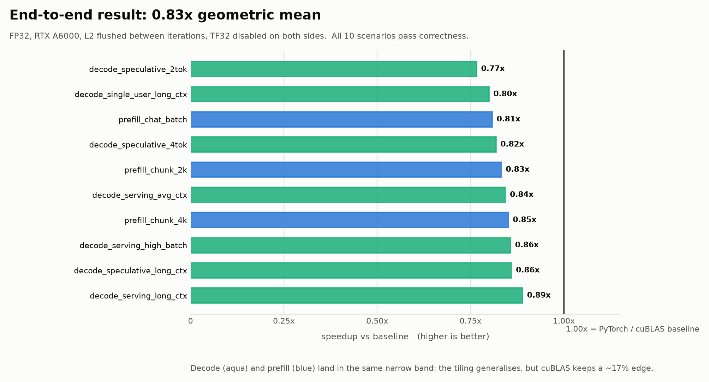

| Scenario | Phase | B | Sq | Sk | Base ms | Fused ms | Speedup |
|---|---|--:|--:|--:|--:|--:|--:|
| `decode_single_user_long_ctx` | decode | 1 | 1 | 65536 | 1.91 | 2.39 | 0.80× |
| `decode_serving_avg_ctx` | decode | 128 | 1 | 4989 | 14.27 | 16.92 | 0.84× |
| `decode_serving_long_ctx` | decode | 128 | 1 | 8192 | 23.61 | 26.55 | 0.89× |
| `decode_serving_high_batch` | decode | 256 | 1 | 2048 | 12.91 | 15.06 | 0.86× |
| `decode_speculative_2tok` | decode | 64 | 2 | 512 | 2.59 | 3.38 | 0.77× |
| `decode_speculative_4tok` | decode | 64 | 4 | 768 | 6.16 | 7.53 | 0.82× |
| `decode_speculative_long_ctx` | decode | 132 | 4 | 4096 | 47.19 | 54.90 | 0.86× |
| `prefill_chat_batch` | prefill | 8 | 512 | 512 | 70.55 | 87.32 | 0.81× |
| `prefill_chunk_2k` | prefill | 1 | 2048 | 2048 | 94.15 | 113.11 | 0.83× |
| `prefill_chunk_4k` | prefill | 1 | 4096 | 4096 | 355.46 | 417.61 | 0.85× |

**Average: 0.83× geometric mean** (0.83× arithmetic, 0.84× aggregate
Σbase/Σfused); 0.83× for the seven decode shapes and for the three prefill shapes
alike.

Absolute milliseconds on this box drift by up to ~15% with GPU thermal state,
and both columns drift together — so the ratios are the stable quantity and the
table is reported from a single warm run rather than a best-of. The **first**
scenario of a cold run is not usable: the cuBLAS side is still on a ramping clock
and reads ~50% high, which is why the suite is run twice and the second run
taken.

## Where the Time Goes

`torch.profiler`, summed over the seven decode scenarios:

| step | sum ms | share |
|---|--:|--:|
| **3a** scores | 55.73 | **44.5%** |
| **3c** ctx | 50.52 | **40.3%** |
| **2a1 + 2a2** Q projection | 12.58 | 10.0% |
| 3d output | 2.49 | 2.0% |
| 2c absorb | 2.17 | 1.7% |
| ATen `.contiguous()` copies and fills | 1.57 | 1.3% |
| 2b RoPE + 2a-norm | 0.19 | 0.2% |
| 3b combine | 0.12 | 0.1% |
| **TOTAL** | **125.36** | 100% |

**3a + 3c are 85% of decode.** Both are limited by shared-memory bandwidth, not
by occupancy or instruction scheduling. 

---

# 4. Profiling Different Stages with Nsight Compute

Each subsection names a **deliberately broken build**, the symptom it produces, the
section of the Nsight report the symptom appears in, and the fix it implies. Every
build is re-profiled with `ncu --set full` against the shipped kernel.
Nsight Compute 2023.2.2, RTX A6000 (`sm_86`), FP32, TF32 off.

| build | what it changes | kernels | scenario |
|---|---|---|---|
| **No split-K** | the reduction is not sliced across `grid.z` | 2a1, 2a2 | `decode_single_user_long_ctx` |
| **Fixed `bq` tile** | the `bq` tile is pinned at 128 rows | 2a1, 2a2 | `decode_single_user_long_ctx` |
| **Narrow register tile** | 4×4 outputs per thread instead of 8×8 | 3a, 3c | `decode_serving_avg_ctx` |
| **Over-requested residency** | `__launch_bounds__(256, 3)` instead of `(256, 2)` | 3a, 3c | `decode_serving_avg_ctx` |
| **Deep / shallow reduction tile** | 64- or 16-deep instead of 32 | 3a, 3c | `decode_serving_avg_ctx` |
| **Unpadded shared stride** | no `+1` on the shared row stride | 3a, 3c | `decode_serving_avg_ctx` |
| **Unpadded `scores` stride** | row stride left at `Sk` instead of rounded to 32 | 3a, 3c | `decode_serving_avg_ctx` |
| **Plain staging loops** | staging loops before strength-reduction | 3a, 3c | `decode_serving_avg_ctx` |
| **Shipped** | — | all | both |

## 4.1 Wave quantization → split the reduction

**Build:** No split-K · **Kernels changed:** 2a1 and 2a2, which share
`q_raw_gemm_kernel` and get a `grid.z` slice count each from
`plan_q_gemm_split()`; 3c splits separately, over `Sk` · **GUI:** Launch
Statistics → *Waves Per SM*, then Occupancy.

At `bq = 1`, 2a1's output is `[1 × 1536]` — one `bq` tile by 12 column tiles, so
the entire grid is **12 blocks on an 84-SM GPU**.

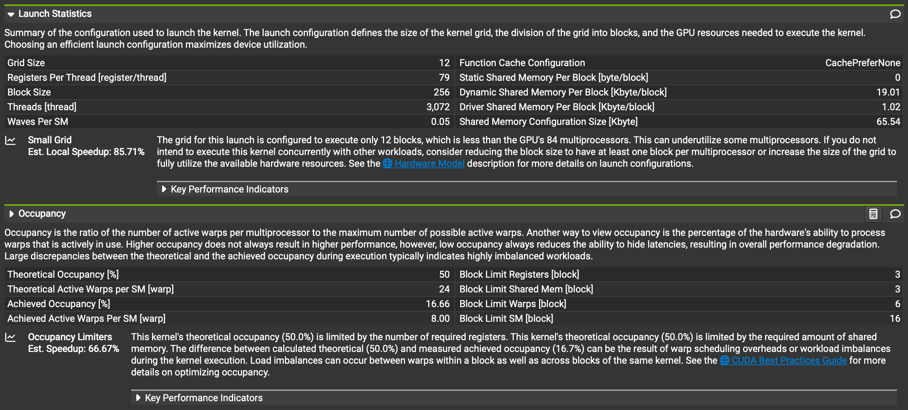

Reading it:

- **Grid Size 12** against 84 SMs — 72 of them never receive a block at all, which
  is the 85.71% Nsight's own *Small Grid* rule estimates.
- **Waves Per SM 0.05** = blocks / (SMs × blocks resident per SM) = 12 / (84 × 3).
  Below one wave there is no steady state; the tail *is* the kernel.
- **Achieved Occupancy 16.66%** against a theoretical 50%. The theoretical figure
  is 24 of the SM's 48 warp slots — the 3 blocks that 79 registers/thread and
  19.01 KB of shared memory both permit. But *Achieved Active Warps Per SM* is
  **8.00**, exactly one block: even the 12 SMs that got work got one block each,
  with nothing to interleave against it.

Note where the *Occupancy Limiters* rule points — registers and shared memory. It
is right about the theoretical 50% ceiling and irrelevant to the time: the gap from
50% down to 16.66% is grid size, and 12 blocks cannot fill 84 SMs however many
would have fit on each. This is a Launch Statistics diagnosis; no memory or
instruction counter points at it.

**Fix.** Slice the 7,168-deep reduction across `grid.z`. It is 224 tiles of 32, and
`plan_q_gemm_split()` targets `kQSplitTargetWaves = 8` waves, landing on **112
slices** — so the grid becomes 12 × 112 = 1,344 blocks over the same output.


| | No split-K | Shipped |
|---|--:|--:|
| Grid size | 12 | 1,344 |
| Waves Per SM | 0.05 | 5.33 |
| Achieved occupancy | 16.66% | 46.30% |
| **duration** | **1.03 ms** | **0.13 ms** |

**7.6×.** Waves per SM lands at 5.33 rather than the 8 requested because the plan
sizes the split against `kTileBlocksPerSM = 2` while this launch actually fits 3 —
1,344 / (84 × 3). The cost is 688,128 reduction requests from the `atomicAdd`
epilogue plus one pre-zeroing of the output.

## 4.2 Work thrown away → size the tile to the problem

**Build:** Fixed `bq` tile · **Kernels changed:** 2a1, 2a2, 2c and 3d — every
kernel whose row axis is `bq` and which therefore calls `bq_reg_for()` (3a and 3c
tile over `flat`, not `bq`, and are untouched) · **GUI:** Instruction Statistics,
then Launch Statistics.

Same scenario, so there is exactly one real query row. Bounds are only checked at
the write-out, so a tile pinned at 128 rows computes 128 rows and stores 1.


The grid is identical to the shipped build — 1,344 blocks, 344,064 threads, same
split-K plan — so every difference below is per-thread work, not a different
launch:

| | Fixed 128-row tile | Shipped (16-row) |
|---|--:|--:|
| Executed instructions | 63,901,824 | 19,018,944 |
| Issued instructions | 63,927,696 | 19,052,396 |
| Avg. executed per scheduler | 190,184 | 56,604 |
| FFMA thread-instructions | 1,409,286,144 | 176,160,768 |
| Registers per thread | 125 | 79 |
| Dynamic shared memory / block | 33.79 KB | 19.01 KB |
| Waves Per SM | 8 | 5.33 |
| **duration** | **226.72 µs** | **134.5 µs** |

Reading it:

- **FFMA thread-instructions are exactly 8×** for identical output — 128/16, the
  ratio between the pinned tile and the 16-row floor `bq_reg_for()` selects. The
  floor is `blockDim.y = 16`, so the shipped build still discards 15 rows of 16; it
  just discards 8× fewer.
- **Executed instructions rise only 3.36×**, not 8×. Staging, addressing and loop
  control are per *block*, and the block count did not change — only the
  register-tile arithmetic scaled with `kBqReg`. Issued tracks executed to within
  0.04%, so nothing is replaying: this is real work thrown away, not a stall.
- **125 vs 79 registers per thread** is the accumulator array. A thread holds
  `acc_t s[kBqReg][8]` — 64 registers at `kBqReg = 8`, 8 at `kBqReg = 1`.
- **Those registers then cost residency.** 125 × 256 = 32,000 registers per block,
  so 65,536/32,000 caps the SM at 2 blocks instead of 3 — which is exactly why
  Waves Per SM reads **8** against 5.33 for the same 1,344-block grid.
- **Shared memory doubles off the same knob**: the staged slabs are
  `(128 + 128) × 33 × 4 B = 33.79 KB` pinned against
  `(16 + 128) × 33 × 4 B = 19.01 KB` adaptive.

**1.69× for identical output**, and duration alone would not say where it went.
Compare predicated-on instruction counts against *useful* output whenever a tile
can be larger than its problem.

## 4.3 Operands re-staged from global → widen the block tile

**Build:** Narrow register tile · **Kernels changed:** 3a and 3c · **GUI:** Memory
Workload Analysis → *Device Memory*, plus Occupancy.

An M×N register tile costs M+N shared loads per M·N FMAs — 8×8 gives 0.25
loads/FMA, 4×4 gives 0.5. But the more visible symptom is in **DRAM**:

```
                                                4×4 tile    shipped
    gpu__time_duration.sum        msecond            14.36        8.58
    dram__bytes.sum (3a)             byte      4.85 GB           3.30 GB   (+47%)
    dram__bytes.sum (3c)             byte      4.17 GB           2.69 GB   (+55%)
    l1tex__..._wavefronts_mem_shared_op_ld       737,383,206  368,713,732  (×2.00)
    launch__registers_per_thread  reg/thread            63         107
    sm__warps_active...pct                 %         66.23       33.04
```

A 64-wide output tile needs twice as many blocks, and **each block re-stages its
own copy of the operands from global memory** — so halving the tile adds ~50% DRAM
traffic on top of doubling shared traffic.

The trap: this build has *double* the occupancy (66.2% vs 33.0%) and is 36% slower
end to end. **Occupancy is not the objective function.** If you tune to the
Occupancy section alone you will make exactly this change and lose.

## 4.4 Register spilling → do not over-request residency

**Build:** Over-requested residency · **Kernels changed:** 3a and 3c · **GUI:**
Occupancy, and Memory Workload Analysis → *Local* row.

Asking for 3 resident blocks caps registers at 65,536/768 = 85; the accumulators
alone need 64.

```
                                                   3 blocks/SM    shipped
    gpu__time_duration.sum                msecond           14.23       8.58
    launch__registers_per_thread  register/thread              80        107
    smsp__inst_executed_op_local_ld.sum      inst     138,359,040          0
    smsp__inst_executed_op_local_st.sum      inst     138,298,368          0
    sm__warps_active...pct                      %           33.07      33.04
```

**Any non-zero local ld/st is the signal** — local memory is DRAM-backed, which is
why `q_raw_gemm`'s DRAM traffic also rises 28.9%. And the occupancy it was traded
for never arrives: 33.07% vs 33.04%, because shared memory already caps residency
at 2 blocks (33.8 KB × 3 = 101 KB > the SM's 100 KB). You pay the register cap and
collect nothing.

## 4.5 Shared memory capping residency → size the reduction tile to it

**Build:** Deep reduction tile (64, too deep) and shallow reduction tile (16, too
shallow) · **Kernels changed:** 3a and 3c · **GUI:** Occupancy → *Shared Memory
Per Block* and the occupancy-limiter chart.

```
                                             depth 64  shipped  depth 16
    gpu__time_duration.sum   msecond           11.64    8.58            9.21
    sm__warps_active...pct         %           16.66   33.04           33.04
    launch__registers_per_thread             107      107             115
    bank conflicts                              0     663,937            0
```

At depth 64 the block needs 67.6 KB of shared memory, so only one block fits and
occupancy halves exactly — the Occupancy section names *Shared Memory* as the
limiter. 36% slower.

Depth 16 is the instructive failure: it reaches **zero** bank conflicts — the
metric [4.6](#46-shared-memory-bank-conflicts--pad-the-row-stride) is about — and
is still 7% slower, because it doubles the tile count and therefore the barriers
(`stall_barrier` rises). **A metric improving is not the goal; time is.** 32 is the
largest depth that keeps two blocks resident.

## 4.6 Shared-memory bank conflicts → pad the row stride

**Build:** Unpadded shared stride · **Kernels changed:** every GEMM (3a and 3c
shown) · **GUI:** Memory Workload Analysis → *Shared Memory* table, and the Warp
State chart.

Without padding, the row stride is a multiple of 32 floats, so column `r` of every
row lands in the same bank and the strip's 8 column loads serialize.

```
                                                       unpadded   shipped
    gpu__time_duration.sum                msecond          29.60       8.58
    l1tex__data_bank_conflicts_..._op_ld.sum        2,944,680,278    663,937
    l1tex__data_pipe_lsu_wavefronts_mem_shared_op_ld  3,313,000,000  368,713,732
```

**The tell is wavefronts ≫ requests with DRAM traffic flat.** Every kernel in the
pipeline slows 2.5–3.9× while DRAM bytes do not move at all — that combination can
only be on-chip serialization. `Shared Memory` in Memory Workload Analysis reports
the conflict count directly; `stall_short_scoreboard` rises in Warp State.

Fix: pad the shared row stride by one element. 4,473× fewer conflicts.
The shipped kernel is *not* conflict-free — 663,937 remain, 0.18% of wavefronts.

## 4.7 The `scores` row stride — profile the consumer, not the producer

**Build:** Unpadded `scores` stride · **Kernels changed:** 3a writes `scores`, 3c
reads it back · **GUI:** Memory Workload Analysis → *Device Memory* on **3c**,
not 3a.

`scores` is `Sk` wide and `Sk` is a runtime value; at 4,989 a row is 19,956 B, so
unpadded every row starts at a different offset in a cache line.

The obvious kernel to open is 3a, which *writes* `scores` — and its store
efficiency does degrade, 3.60 → 5.00 sectors per request. But 3a's DRAM traffic
moves 0.6%, because that write is 327 MB of its 3.3 GB. **From the producing kernel
alone you would conclude the padding does not matter.**

The cost lands on the consumer. 3c reads all of `scores` back:

| | shipped | unpadded stride |
|---|--:|--:|
| 3a sectors/request (global ST) | 3.60 | 5.00 |
| 3c sectors/request (global LD) | 3.00 | 3.29 |
| **3c DRAM bytes** | **2.69 GB** | **3.00 GB** (+11.6%) |
| 3a + 3c DRAM total | 5.99 GB | 6.32 GB (**+329 MB / step**) |

So the metric is **main-memory traffic** (`dram__bytes.sum`, or DRAM throughput in
SOL), read across the producer–consumer pair, with `sectors_per_request` as the
mechanism that explains it. Wall clock moves only ~0.5% here because 3c runs at 44%
of peak DRAM throughput and has headroom to absorb 11% more bytes — but the traffic
is real and binds on a more bandwidth-limited part or a longer `Sk`.

## 4.8 Address math stealing issue slots → strength-reduce the staging loops

**Build:** Plain staging loops · **Kernels changed:** all five GEMMs (3a and 3c
shown) · **GUI:** Instruction Statistics.

```
                                                     plain staging       shipped
    gpu__time_duration.sum               msecond               9.38          8.58
    smsp__inst_executed.sum                 inst      2,450,441,216 2,258,875,136
    smsp__..._op_integer_pred_on.sum        inst     13,814,125,056 8,514,286,080
```

Integer thread-instructions fall 38% and issued instructions 7.8% with FFMA work
identical. The signature is a **uniform ~7–14% slowdown across every GEMM kernel
with DRAM traffic flat** — no memory metric moves, so the cost has to be issue
bandwidth.

## 4.9 Choices validated by a counter reading zero

Three designs have no cheap counterfactual; the evidence is that the counter which
*would* show the cost reads zero. Weaker evidence, labelled as such.

- **Exponentials in 3a's epilogue, not 3c.** 3a issues 2,715,648 special-function
  (`smsp__inst_executed_pipe_xu`) instructions; 3c issues 12,288. 3c stages each
  score once per rank tile — four times — so exponentiating there would cost 4×.
- **Per-block `(m_j, l_j)` partials instead of `atomicMax`.** 3a issues **0**
  global atomic and **0** reduction requests. For contrast, split-K's `atomicAdd`
  epilogue in 2a1 shows 688,128 reduction requests — the cost that was avoided.
- **`bq`-blocked weight reuse.** `q_raw_gemm` shows a 72.2% L2 sector hit rate at
  `bq = 128` against 2.4% at `bq = 1`: the reuse the layout exists to create,
  visible in Memory Workload Analysis → *L2 Cache*.

---

# 5. Build and Run

Requires an NVIDIA GPU of compute capability 8.0+ (prebuilt for `sm_80`, `sm_89`,
`sm_90`), CUDA 12.x, and conda. Built and verified against **Python 3.9 +
PyTorch 2.3.0 (cu121)**.

```bash
conda create -n ece285 python=3.9 -y
conda activate ece285
pip install torch==2.3.0 torchvision==0.18.0 --index-url https://download.pytorch.org/whl/cu121
pip install ninja          # optional, speeds up rebuilds
```

`run_eval.sh` activates the env (override with `MLA_CONDA_ENV` / `CONDA_ROOT`),
rebuilds the extension, and runs the suite:

```bash
bash run_eval.sh                     # all 10 scenarios
bash run_eval.sh --quick             # smoke test (1 scenario)
bash run_eval.sh --phase decode      # the 7 decode scenarios
bash run_eval.sh --phase prefill     # the 3 prefill scenarios
bash run_eval.sh --scenario decode_serving_avg_ctx

MLA_SKIP_BUILD=1 bash run_eval.sh --decode-focus   # skip the rebuild
```

`--decode-focus` is **not** "all decode" — it is a hardcoded 2-scenario tuning
subset. Use `--phase decode` for all seven.

## Repo Layout

| File | Purpose |
|---|---|
| `mla_kernels.cu` | All eight CUDA kernels + pybind11 bindings; carries the full design rationale in comments |
| `setup.py` | Builds the PyTorch CUDA extension |
| `run_eval.sh` | Rebuild + run the benchmark suite |
| `exhaustive_benchmark_suite.py` | PyTorch baseline, fused path, correctness + timing across production shapes |
| `stage_profile.py` | Per-stage timing + roofline |
| `kernel_profile.py` | `torch.profiler` breakdown of kernel 3's sub-stages |
| `check_dtypes.py` | Correctness sweep across fp16/fp32/fp64, plain and split-K paths |
| `check_3d.py` | Correctness sweep over shapes straddling tile boundaries |
| `docs/make_figures.py` | Regenerates every pipeline figure above and `docs/mla_figures.pdf` |
| `docs/*_BQ.*`, `docs/*K-Split*` | Nsight Compute screenshots used in [Section 4](#4-profiling-different-stages-with-nsight-compute) (PDF as captured, PNG for the README) |
